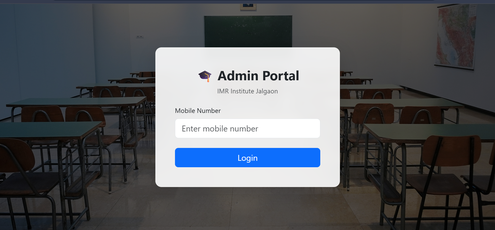
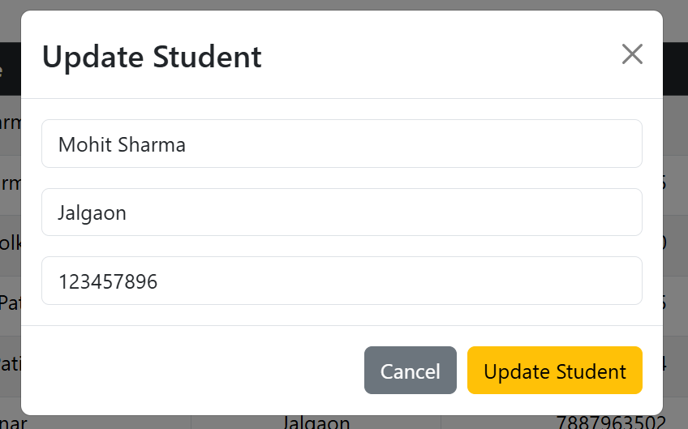

# 🎓 Student Management System

A **Student Management System Web Application** built using **React (Vite), Bootstrap, Axios, and Spring Boot REST API**.
This project allows users to **login and manage student records with full CRUD functionality**.

---

# 🚀 Features

* 🔐 Login Authentication
* 📊 Student Dashboard
* ➕ Add New Student
* ✏ Edit Student Details
* 🗑 Delete Student
* 🔍 Search / Filter Students
* 📱 Responsive UI with Bootstrap
* 🔗 REST API Integration using Axios

---

# 🛠 Tech Stack

### Frontend

* React (Vite)
* React Router
* Bootstrap
* Axios

### Backend

* Spring Boot
* REST API
* MySQL Database

---

# 📸 Application Screenshots

## 🔐 Login Page

User login interface for accessing the student dashboard.

---

## 📊 Student Dashboard

Displays all student records with edit and delete options.

---

## 🔍 Search Filter

Users can search students by name using the search bar.

---

## ➕ Add Student

Modal form to add a new student.

---

## ✏ Edit Student

Update student information using the edit modal.

---

# 👨‍💻 Author

**Aalok Sharma**

GitHub:
https://github.com/Aalok-Sharma1

---

# ⭐ Support

If you like this project, please **give it a star ⭐ on GitHub**.
